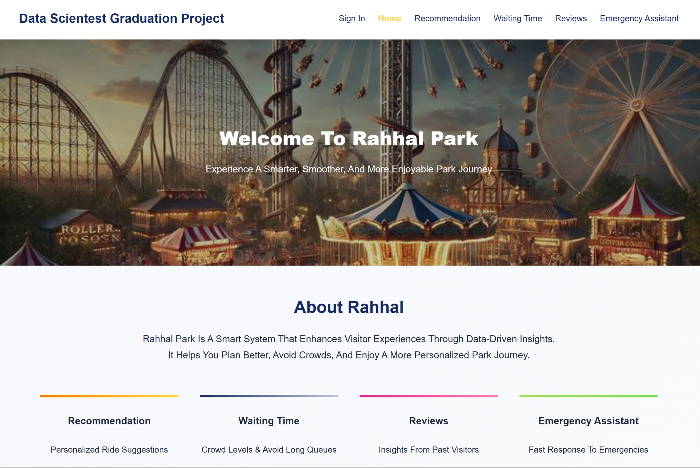

# Rahhal-Park
Rahhal Park is an intelligent web-based platform designed to improve visitor experiences in entertainment cities using Artificial Intelligence and Data Science techniques. The platform provides smart services including personalized recommendations, waiting time prediction, sentiment analysis, and emergency assistance.


# Problem Statement 
Visitors in entertainment parks often face challenges such as:

- Choosing suitable rides and activities.
- Long waiting times and crowded areas.
- Difficulty obtaining emergency assistance quickly.
- Lack of personalized recommendations.
- Limited use of visitor feedback for service improvement.

Rahhal Park solves these problems through an integrated AI-powered platform.


# Project Features
### Recommendation System
Provides personalized ride and activity recommendations based on:
- Age group
- Height & weight
- Health conditions
- Visitor preferences
- Fear of heights
- Group type
Built using TensorFlow and Deep Learning models.

### Waiting Time & Crowd Prediction
Predicts:
- Crowd level
- Estimated waiting time
Using Random Forest machine learning models and temporal features.

### Sentiment Analysis
Analyzes visitor reviews and classifies them into:
- Positive
- Negative
Using TF-IDF and Logistic Regression

### Emergency Assistant
A bilingual emergency chatbot (Arabic & English) that detects:
- Medical emergencies
- Security incidents
- Fire & safety issues
The chatbot automatically generates a case ID and routes the report to the appropriate team.

# About the Dataset
The datasets used in Rahhal Park were collected from public sources such as Kaggle and processed through a unified preprocessing pipeline before training the machine learning models.

The collected datasets include structured, temporal, and textual data to support different intelligent services within the platform.

| Dataset                 | Description                                                                                                        |
| ----------------------- | ------------------------------------------------------------------------------------------------------------------ |
| Recommendation Dataset  | Visitor demographic and preference data including age, height, weight, health conditions, and activity preferences |
| Waiting Time & Crowd Dataset | Historical attendance, temporal patterns, waiting time, and crowd-related records                                  |
| Sentiment Dataset       | Visitor reviews and feedback used for sentiment classification                                                     |
| Emergency Dataset       | Bilingual Arabic & English emergency keywords for emergency detection                                              |

### Data Preprocessing
Several preprocessing techniques were applied before training, including:
- Missing value handling
- Duplicate removal
- Text cleaning
- Feature encoding
- Normalization
- TF-IDF vectorization
- Feature engineering
Python libraries such as Pandas, NumPy, Scikit-learn, and TensorFlow were used during preprocessing and model development

### Dataset Sources
- Recommendation Dataset: [Click Here](https://www.kaggle.com/datasets/example)
- Waitin Time & Crowd Level Dataset: [Click Here](https://www.kaggle.com/datasets/ayushtankha/hackathon?select=waiting_times.csv)
- Sentiment(Reviews) Dataset: [Click Here](https://www.kaggle.com/datasets/dwiknrd/reviewuniversalstudio)

##  Installation & Run

#### 1 Create virtual environment

```bash
python -m venv venv
```

#### 2 Activate virtual environment

##### Windows

```bash
venv\Scripts\activate
```

##### Mac / Linux

```bash
source venv/bin/activate
```

#### 3 Install required packages

```bash
pip install -r requirements.txt
```

#### 4 Run the application

```bash
python app.py
```

#### 5 Open in browser

```bash
http://127.0.0.1:5010
```

```md id="rj14a6"
## Screenshots

### Landing Page

<p align="center">
  
</p>

---

### Home Page

<p align="center">
  
</p>
```


## Team Member

Developed by Data Science Students
College of Computing – Umm Al-Qura University
2026

- Rahaf Yaseen Barnawi
- Hala Fayez Alharbi
- Sarah Khaled Alotaibi
- Raghad Adel Alzulafi

## License
This project was developed for academic purposes as a Graduation Project.


